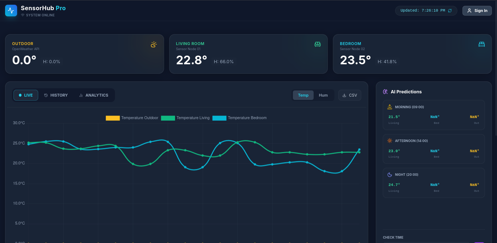
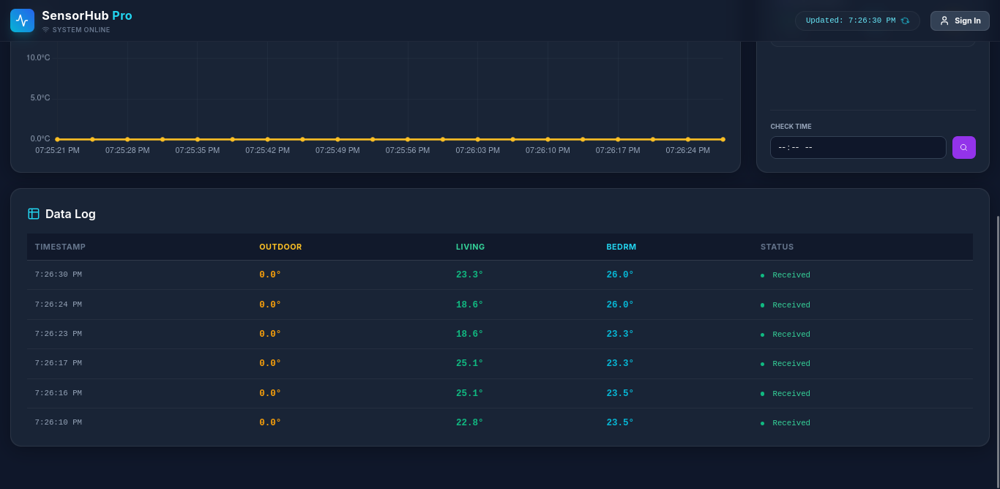

# 🌡️ SensorHub Pro - IoT Analytics Dashboard


**SensorHub Pro** is a comprehensive IoT environmental monitoring platform designed to provide real-time data visualization, deep historical analysis, and scalable sensor management.

Beyond displaying raw data, the system evaluates **Infrastructure Health** (Uptime, power outages) and utilizes **Machine Learning algorithms** (Linear Regression) to project future climate trends.

## ✨ Key Features

### 📡 Real-Time Monitoring
- **Live Data Streaming:** High-performance streaming using **Redis Pub/Sub** and **Server-Sent Events (SSE)**.
- **External API Integration:** Connects with OpenWeatherMap to compare indoor vs. outdoor conditions.
- **Multi-Zone Support:** Seamlessly monitors multiple nodes (Living Room, Bedroom, Outdoor).

### 📊 Advanced Analytics & BI
- **System Health (Uptime):** Automatic detection of power outages or sensor disconnections (gaps > 20 min).
- **Thermal Stability:** Calculates Standard Deviation (SD) to evaluate thermal insulation efficiency.
- **Flexible History:** Persistent storage using **SQLAlchemy** (Support for SQLite or PostgreSQL) with fast filtering by range or "Last N Hours".
- **Visualization:** Interactive comparative charts (Chart.js) and Min/Max/Avg data tables.

### 🤖 AI & Predictions
- **Prediction Engine:** Client-side Linear Regression implementation to forecast short-term temperature trends (Morning, Afternoon, Night).

### ⚙️ Sensor Management
- **Management Interface:** Dynamic UI to add, edit, or remove sensors on the fly.
- **Authentication:** Modern Sign In / Sign Up interface for secure access.

## 🛠️ Tech Stack

* **Backend:** Python (Flask), Flask-Blueprints.
* **Real-time Engine:** Redis (Key-Value & Pub/Sub).
* **Storage:** SQLite (default) or PostgreSQL. Configurable via `DATABASE_URL`.
* **Frontend:** HTML5, Vanilla JavaScript (ES Modules), TailwindCSS.
* **Hardware (Client):** Compatible with ESP32/ESP8266 nodes (HTTP POST).

## 🚀 Installation & Setup

### Prerequisites
- **Redis Server** installed and running (`redis-server`).
- **Python 3.13+**

1.  **Clone the repository:**
    ```bash
    git clone https://github.com/your-username/sensorhub-pro.git
    cd sensorhub-pro
    ```

2.  **Install dependencies using `uv`:**
    ```bash
    uv sync
    ```

3.  **Environment Configuration:**
    Create a `.env` file (see `.env.example` if available):
    * `OPENWEATHER_API_KEY`: Your OpenWeatherMap API Key.
    * `REDIS_HOST`: localhost (default)
    * `REDIS_PORT`: 6379 (default)
    * `DATABASE_URL`: (Optional) Connection string for PostgreSQL or SQLite. Defaults to `sqlite:///sensors.db`.

4.  **Run the application:**
    ```bash
    uv run manage.py
    ```
    Visit `http://localhost:5000` in your browser.

5.  **Run ESP32 Simulator (Optional):**
    If you don't have physical sensors yet, you can send simulated data:
    ```bash
    uv run test/esp32_simulator.py
    ```

## 📸 Screenshots

### Dashboard & Analytics



### Sensor Management & History


---
Built with ❤️ by JorgeArguello
